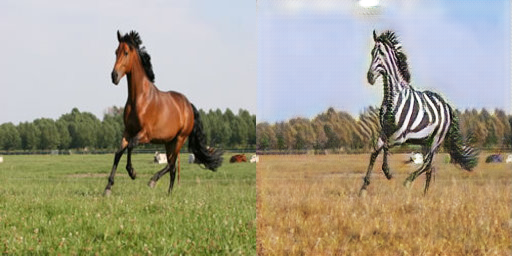
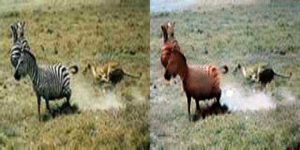
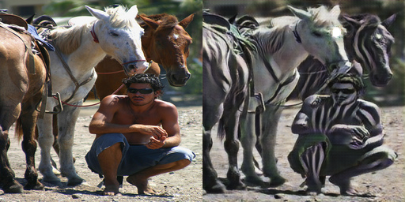
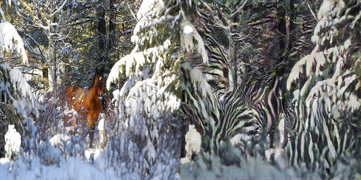
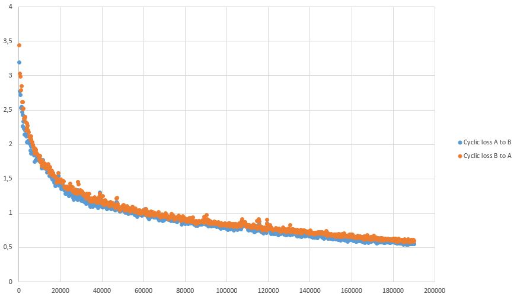
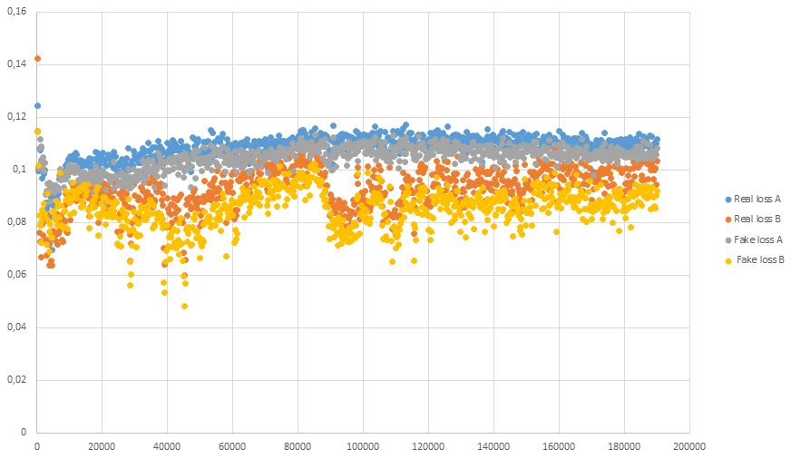

# Caffe_CycleGAN: A Caffe/C++ implementation of [Unpaired Image-to-Image Translation using Cycle-Consistent Adversarial Networks](https://arxiv.org/pdf/1703.10593.pdf)

This is my implementation of CycleGAN algorithm with Caffe for image-to-image translation without input-output pairs. For real-case application, you should use the [original implementation](https://github.com/junyanz/CycleGAN) in Torch.

*Horse to Zebra*

*Zebra to Horse*

## Dependencies

This code relies on [Caffe main branch](https://github.com/BVLC/caffe) with only two slight modifications in `solver.hpp`: 

- ApplyUpdate function must be moved from protected to public in Solver class definition
- iter_ must be moved from protected to public in Solver class definition

OpenCV and boost are also used, but you should already have them installed if you have Caffe.

I have only tested this code on Windows with Visual Studio 2015, but it should also be able to run on Linux and Mac Os provided that Caffe is correctly installed with the above modification.

## Building

The project uses CMake as a building tool.
Once you have correctly built and compiled the code, you should be abble to launch the program for both training and testing.

## Testing

To test a trained model, set the testing parameters in `launch_files/test.bat` as you like and then launch the script.

The network doesn't perform very well for every images...

*He doesn't look like a horse to me*

*Well, at least it is hidden now*

## Training

First, you need to create two folders with all the images of your training sets. Then you can train a model: set the training parameters as you want in `launch_files/train.bat` and run it. Images are saved at the beginning of each epoch to show the evolution of the learning process. Loss values are also saved in a csv file to monitor the training. Prototxt files (generator.prototxt and discriminator.prototxt) are regenerated everytime the program is launched (because they have to be changed according to training parameters).

If you see that the images seems to be negative (black is white and white is black) try to start a new training. I assume it's because the cyclic loss is computed from G1(G2(x)) so if both G1 and G2 invert the colors it comes back to real ones.

During training, caffemodel and solverstate files are used if you want to continue the training after stoping it.

When training on Horse2Zebra dataset with a learning rate of 0.0002 for 100 epochs (one epoch is 1067 training steps) and then for ~80 more epochs with a linearly decreasing learning rate, I got these curves:

### Resuming Training

To resume training, you just need to add the snapshosts parameters to the `train.bat` file and launch it again. If the program finds the log file it will add the new values after what's already written.

## License

MIT